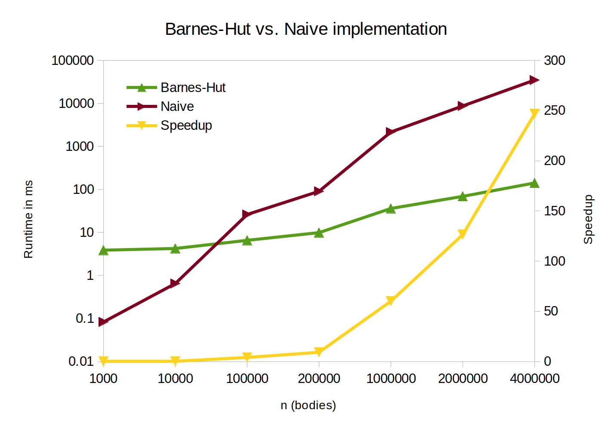

Implementation of clustered n-body simulation (Barnes-Hut algorithm using
octrees) in [Futhark](https://futhark-lang.org/) written in collaboration with
Thomas Veje Christensen and Sebastian Posselt. Dependencies are downloaded with
```futhark pkg sync``` and benchmarks may be generated by issuing ```make
benchmarks```. The benchmarks shown below are produced on a GTX 2080 Ti GPU,
against a naive $O(n^2)$ implementation written by Troels Henriksen, who also
supplied the radix-tree implementation.


